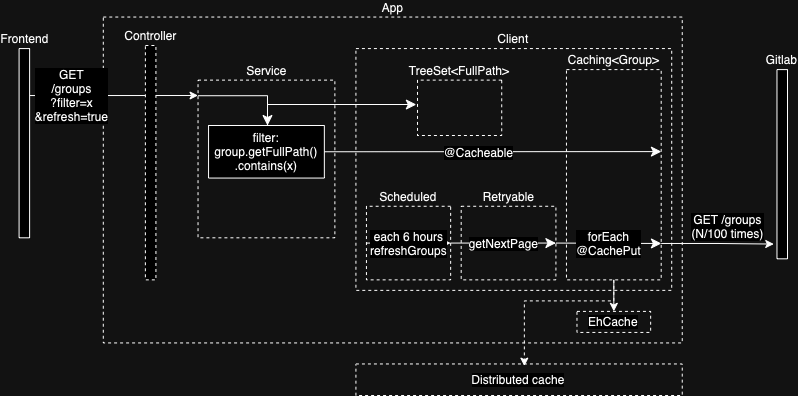

# Gitlab Proxy
This project is a simple proxy for Gitlab API. It is a Spring Boot application that forwards requests to Gitlab API and returns the response to the client. The main goal of this project is to demonstrate how to use Spring Boot, Docker, and Docker Compose. 
And also be a starting point for other projects that need to use Gitlab API.
Also further improvements can be added to the project like caching, rate limiting, etc. See the section [Further improvements](#further-improvements) for more details.

# Table of Contents
- [Gitlab Proxy](#gitlab-proxy)
- [Build and run the application](#build-and-run-the-application)
    - [Build and run using docker-compose](#build-and-run-using-docker-compose)
    - [Build and run using docker](#build-and-run-using-docker)
        - [Build](#build)
            - [Build docker image using the Dockerfile](#build-docker-image-using-the-dockerfile)
            - [Build docker image with gradle](#build-docker-image-with-gradle)
        - [Run](#run)
- [Test the application](#test-the-application)
- [Debug](#debug)
    - [Debug building of the docker image](#debug-building-of-the-docker-image)
    - [Inspect built container](#inspect-built-container)
- [Further improvements](#further-improvements)
- [Add more features like caching, rate limiting, etc](#add-more-features-like-caching-rate-limiting-etc)
- [Add more endpoints to the proxy like /projects, /users, etc](#add-more-endpoints-to-the-proxy-like-projects-users-etc)
- [Add more tests like integration tests, contract tests, etc](#add-more-tests-like-integration-tests-contract-tests-etc)
- [Add more security like authentication, authorization, etc](#add-more-security-like-authentication-authorization-etc)
- [Add more monitoring like metrics, alerts, etc](#add-more-monitoring-like-metrics-alerts-etc)
- [Add more CI/CD like pipelines, deployments, etc](#add-more-cicd-like-pipelines-deployments-etc)
- [Add more logging like structured logs, log aggregation, etc](#add-more-logging-like-structured-logs-log-aggregation-etc)
- [Add more error handling like retries, circuit breakers, etc](#add-more-error-handling-like-retries-circuit-breakers-etc)
- [Add more performance improvements like async, batching, etc](#add-more-performance-improvements-like-async-batching-etc)
- [Add more configurations like timeouts, retries, etc](#add-more-configurations-like-timeouts-retries-etc)
- [Add more environments like dev, test, prod, etc](#add-more-environments-like-dev-test-prod-etc)
- [Add more examples like how to use the proxy in a real project](#add-more-examples-like-how-to-use-the-proxy-in-a-real-project)
- [Add more comments in the code](#add-more-comments-in-the-code)

# Simple target architecture:

[Edit](https://viewer.diagrams.net/?tags=%7B%7D&lightbox=1&highlight=0000ff&edit=_blank&layers=1&nav=1#R%3Cmxfile%3E%3Cdiagram%20id%3D%22sIVUU5Nqvf2JdoVW1s2s%22%20name%3D%22Page-1%22%3E7VtZc9s2EP41mnEe5OGh89GSbKdp0mbiTh33JQOREEUbIlgQsqT%2B%2Bi4I8AJJSbYZ2bHkh4RYgItjd789QLXs8WJ9zVA4%2F0JdTFqW4a5b9qRlWX3Thn8FYaMI%2Fb4keMx3JcnMCDf%2Bf1gRDUVd%2Bi6OCgM5pYT7YZHo0CDADi%2FQEGN0VRw2o6Q4a4g8XCLcOIiUqbe%2By%2BeSOrD6Gf0j9r15MrPZG8qeBUoGq51Ec%2BTSVY5kX7bsMaOUy6fFeoyJOLvkXOR7VzW96cIYDvg%2BL3z6Oh2yf25%2FGDz8c3Tr09mXz5%2FapiXZPCKyVDtWq%2BWb5AgYXQYuFlyMlj1azX2Ob0LkiN4VyBxoc74g0DLh0UXRPB4rGh5BUaTe8xhyfVjqmBLKgBbQADiMZj4hGkmtCDOO17V7NdMTBM3DdIE528AQ9UKqPkrrhl3ZXGUitPtqyDwvPksNREptvJR1drLwoA63%2BqDp6P63m%2BCuQ36f0NvrxY%2B%2F7%2FvTdqd0zteXf7WsHoGZR1MGTx6P937lwXmDcpe77KsII%2BbE6%2B%2BP1q3%2BpCQq7ILyqiZlfE49GiBymVFHRWFmYz5TGiqp3WPON8oS0ZLTooBBAmzzXb0fN%2B5E4xxOTrUn63zvZKNaNTIEe0bMw3zL2SUYIna3j%2FTbxrkxHFoFDUgEyzBB3H8sWneVtBX3r9SH5aasTauoWGZHU5iILpmD1Vt5a9QYWZ0iI8swiozkqWxhlAyks1mEC2NiBU2P5fk6mxhRHhw6xhg5c4ymoE0V2ispMxqvcCZBAqj%2FLgXKjT5i8oi576CMlLwKe72uU3xFgT1Ixi%2Be7Kx5lssIswAtcPOcP9SyfAlO11pjCXdrzazT12zBNkooaxoVKNvTVL0xkE1d7WERce3z77lniYdd1crQUDQSMKxD0WeDqMSdPUB0N9p29kTbp0HpBWNokxsQChiLfgps2Q3HNA3YimXvtpXuIU3F7J1MZZcF7DYVo2lTeZlMy0EmhNccQ2x9UXarcZx5tSTkK2QqZx%2FKA84hp%2BLID6LUXUYhCgo6k%2FgqB06Ztx0Zx1%2BIDXvTMzgc2IdhWgP5YHyQXk3zb%2Bucf5MTpH7vlY3W1oO9KgdnHtRqBxXQJk8vZLhSNCJkaCuykExA2QKR%2BICMuO8RMR%2FB%2Fw4SKXXlkJXam%2BjsGNK4DAKWjlkbROb4gVd%2Bk7JwjgLFUkGBMCq85m1EfC%2BQPRFYGc91%2BSDiQM1lhOtcD2fAbgYzJHOpbFGII87zixOtKHOLq0vZwYamDz5wFGwjAKs2cu%2BXEddZFMdxRh9wW8m%2BvDwXO5SBldNAX98UOQ9erLy6iVjdrrSN%2FIM0E6PamoyCLUnxzNDCJxs5FASPFsIUlPg%2FYT5iwoih7wsNqN4v2S2gJ5KmlHKNYhAXPIfng5BX2u5OYKjlZMTm21aTarqjT3OD2aPv4Bqg2JoxxGZREzALsRVBQ8p4d4lC6e%2FEAVUV8DoSoALRO7lQHQvfdWOXWYVSRRxrAqiSLDQBKqMMVL0KnLJ%2FGk4NTzh1wqmjw6kxcGGUEMxOUFWXCFlvDKpsswKqQB8gRfiGZwxH89dIlIQ%2BXilzmWTFIdmh3jIt1U4k3oJTiv%2B2ZE39t1OmNc5N%2BCtoQ9tsqEyrp9sdTX32LtNqjNKLhR1l2vpqx54L7nc1zZYcD14Dfroj35YLal5hf9fx1gKDd%2Bj9twQ8zwsMXtnnj4m4bjw2%2F9oZakDy2v7VGryG%2F0wKjVlx8S7XU11o3Mvn2lt8bq34dlccGy8kVruZrlbRsmzt%2BrLGnTXlTbolbxLfghtbrr3P%2FoDOWIsN7i9wVC4LvtG6da02aELeWz22BVJWMY5KxPxSddFv%2BAbPvO3u9TRGeoX0sLfdlZ%2FCnEqrv2DQcipZvLBkccWADQ7c91yweNGnZFo81TlcOFX9wV5VueKUkL1HbHtvCdk37PrRscGHno%2B9PoCcwpxfDwqOOMx5SjBzEYY74phjgR1bS7h65Q%2FgD4s6e3yTB1HohfjFRnaoOTkUT0i%2FBYkhQBEGLXGl4eZazpI9pr9JyC5Gsi%2FI7vJ9W%2B9FSrn7jouS%2BkyzLLodnwJ2m8np9S%2FY0wD3qTl9p6sXB%2FbL6ZvK181yMel4VaquQnQYnep1h%2BfdZrSqVCna88KtMa2q%2BM3DKb96l0HVe8uvrn1O0PTYIp2e5s8q8qtBM5EONLNfa0q8yX7yal%2F%2BDw%3D%3D%3C%2Fdiagram%3E%3C%2Fmxfile%3E)

# Build and run the application

## Build and run using docker-compose:
```bash
docker compose up
```
## Build and run using docker:

### Build

#### Build docker image using the Dockerfile:
```bash
docker buildx build --platform amd64 -t gitlab-proxy .
```

#### Build docker image with gradle:
```bash
gradle bootBuildImage --imageName=gitlab-proxy
```

### Run:
```bash
docker run -p 8080:8080 --platform amd64 -ti gitlab-proxy
```

# Test the application
```bash
curl http://localhost:8080/groups
```

# Debug
## Debug building of the docker image:
```bash
docker buildx build --platform amd64 --progress=plain -t gitlab-proxy --no-cache .
```

## Inspect built container:
```bash
docker run -p 8080:8080 --platform amd64 -ti --entrypoint /bin/sh gitlab-proxy
```
# Further improvements
## Add more features like caching, rate limiting, etc
Cache the responses from Gitlab API. This will reduce the number of requests to Gitlab API and improve the performance of the proxy. However, it will increase the complexity of the proxy because it will need to manage the cache, evict the cache, etc.
A force flag can be added to endpoints to force the proxy to fetch the data from Gitlab API and update the cache.
Rate limiting can be used to prevent abuse of the proxy. For example, the proxy can limit the number of requests per second, per minute, per user, per IP, etc. It can be done using a tool like RateLimiter, etc.

## Add more endpoints to the proxy like /projects, /users, etc

## Add more tests like integration tests, contract tests, etc

## Add more security like authentication, authorization, etc
It can be done using a tool like Spring Security, OAuth, etc.

## Add more monitoring like metrics, alerts, etc
It can be done using a tool like Prometheus, Grafana, etc.
For example, the proxy can expose metrics like the number of requests, the response time, the number of errors, etc. It can be done using a tool like Micrometer, etc.

## Add more CI/CD like pipelines, deployments, etc
It can be done using a tool like Jenkins, Gitlab CI, Github Actions, etc.

## Add more logging like structured logs, log aggregation, etc.
It can be done using a tool like Logback, Log4j, etc.
Structured logs is important because it makes it easier to search, filter, etc.
Further this logs can be sent to a log aggregator like ELK, Splunk, etc.
Errors can be aggregated using a tool like Sentry, Rollbar, etc.

## Add more error handling like retries, circuit breakers, etc
It can be done using a tool like Resilience4j, Hystrix, etc.
Resilience4j is a lightweight fault tolerance library inspired by Netflix Hystrix, but designed for functional programming. Resilience4j provides higher-order functions (decorators) to enhance any functional interface, lambda expression or method reference with a Circuit Breaker, Rate Limiter, Retry or Bulkhead. Bulkhead is a pattern used to prevent a single failing component from bringing down the entire system.

## Add more performance improvements like async, batching, etc
It can be done using a tool like Reactor, RxJava, etc.
Reactor is a fourth-generation Reactive library for building non-blocking applications on the JVM based on the Reactive Streams Specification. It could be used to improve the performance of the proxy by making the requests to Gitlab API asynchronous.
Batch requests can be used to reduce the number of requests to Gitlab API. For example, instead of making 10 requests to Gitlab API to get the details of 10 groups, the proxy can make a single request to Gitlab API to get the details of 10 groups.

## Add more configurations like timeouts, retries, etc
It can be done using a tool like Spring Cloud Config, Consul, etc.
Spring Cloud Config provides server and client-side support for externalized configuration in a distributed system. With the Config Server, you have a central place to manage external properties for applications across all environments. The concepts on both client and server map identically to the Spring Environment and PropertySource abstractions, so they fit very well with Spring applications but can be used with any application.
Another option is to use Consul. Consul is a distributed, highly available, and data center-aware solution to connect and configure applications across dynamic, distributed infrastructure. Consul provides a flexible solution for service discovery, configuration, and segmentation that can be used with any application.

## Add more environments like dev, test, prod, etc
It can be done using a tool like Docker, Kubernetes, etc. Another option is to use Spring Profiles.

## Add more examples like how to use the proxy in a real project
For example, how to use the proxy in a frontend application, how to use the proxy in a backend application, etc.

## Add more comments in the code
Is always good to have comments in the code to explain why the code is there, what the code is doing, etc.

